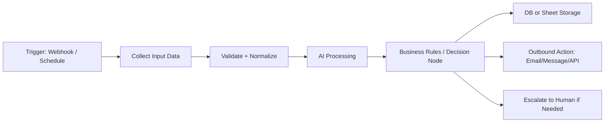
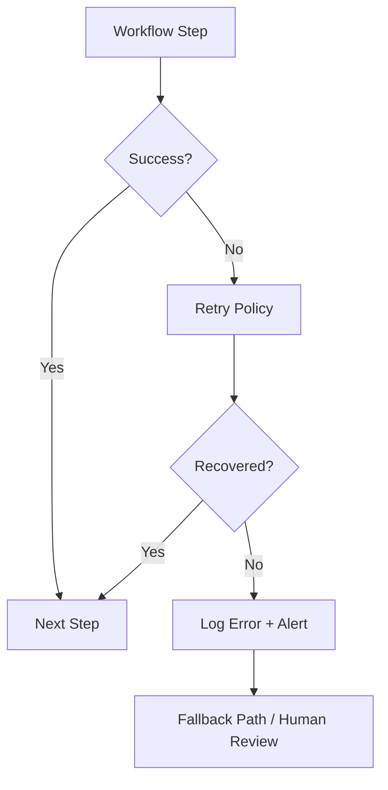

<h1 align="center">B. Naga Venkatesh Raju</h1>
<p align="center"><strong>Automation Developer | AI Automation | Python | n8n | APIs</strong></p>
<p align="center"><em>Building AI-powered automations that turn repetitive processes into reliable workflows.</em></p>

---

## Professional Tagline Options
1. **Building AI-powered automations that turn repetitive processes into reliable workflows.** ✅ *(Selected)*
2. Designing practical automation pipelines that connect APIs, AI models, and business tools.
3. Creating automation systems that reduce manual effort and improve operational speed for real teams.

## About Me
B.Tech CSE student focused on becoming a strong **Automation Developer / AI Automation Engineer**.

I build and iterate on practical systems for:
- workflow automation
- API integrations
- AI-assisted processes
- backend and data automation

My goal is to work with startups and businesses to automate real-world operations with reliable, maintainable workflows.

## What I Build
- API-driven workflow automations using n8n + Python
- AI-powered business process assistants (lead ops, support, research)
- Web automation and data pipelines with validation + failure handling
- Backend automation flows that connect databases, webhooks, and business apps

## Tech Stack

### Programming


### Automation


### AI


### Backend & Data


### Tools


## Featured Automation Projects
> Status is intentionally transparent to avoid overstating experience.

| Project | Problem it Solves | Core Workflow | Tech | Status |
|---|---|---|---|---|
| **AI Lead Generation & Qualification Automation** | Reduces manual lead research and triage | Find leads → enrich data → AI qualification → store → outreach/follow-up | n8n, Python, APIs, AI | **Currently Building** |
| **AI Customer Support Automation** | Speeds up first-response support and triage | Inbound question → intent detection → info retrieval → response generation → human escalation | n8n, LLM API, Webhooks, Database | **Currently Building** |
| **Automated Job/Internship Tracker** | Avoids repetitive job search and duplicate listings | Collect listings → filter by skills → deduplicate → store → notify | Python, n8n, APIs, Database | **Planned** |
| **AI Web Research Agent** | Cuts down manual web research time | Research prompt → collect allowed sources/APIs → summarize → structured report | Python, AI APIs, n8n | **Planned** |
| **Automated Social Media Content Workflow** | Streamlines idea-to-approval content pipeline | Idea generation → AI draft/captions → content calendar update → approval notifications | n8n, AI APIs, Google Sheets/Notion APIs | **Planned** |
| **Business Appointment Automation** | Automates booking and reminder operations | Request intake → availability check → booking confirmation → reminders → storage | REST API, Firebase, n8n, Python | **Planned** |

## Completed Projects
I’m currently building my public automation portfolio. Completed production-ready projects with repo links, demo videos, and architecture notes will be listed here as they are finalized.

## Currently Building
- AI Lead Generation & Qualification Automation (MVP)
- AI Customer Support Automation (MVP)
- Reusable n8n + Python integration patterns for API-first automation

## Automation Architecture Philosophy
- Design automations as modular workflows (trigger, process, decision, output)
- Prefer API-first integrations over brittle manual steps
- Add retry, fallback, and alerting paths for reliability
- Keep logs and status signals for monitoring workflow failures early
- Use version control and documentation so automations are maintainable

### Architecture Example 1: AI Automation Pipeline


### Architecture Example 2: Failure-Resilient Workflow


## GitHub Statistics


## GitHub Activity & Contributions


## Certifications
- Currently pursuing certifications in Python, APIs, and cloud fundamentals.
- This section will be updated with verified certifications and completion dates.

## Learning Roadmap
- Deepen Python for automation architecture and production tooling
- Build advanced n8n workflows with robust error handling
- Improve API integration design and security practices
- Strengthen database design for automation pipelines
- Expand AI agent and RAG implementation skills

## Open Source & Collaboration
I’m open to collaborating on:
- workflow automation projects
- API integration tools
- AI-assisted business automation systems

If you’re building practical automation products for startups or operations teams, feel free to connect.

## Contact
- **GitHub:** [github.com/bhattunagavenkateshraju-blip](https://github.com/bhattunagavenkateshraju-blip)
- **LinkedIn:** [linkedin.com/in/your-linkedin-username](https://www.linkedin.com/in/your-linkedin-username/)

## Recommended Repository Structure (Automation Projects)
```text
automation-project/
├── README.md
├── workflows/
├── src/
├── config/
├── tests/
├── docs/
├── .env.example
├── requirements.txt
└── .gitignore
```
